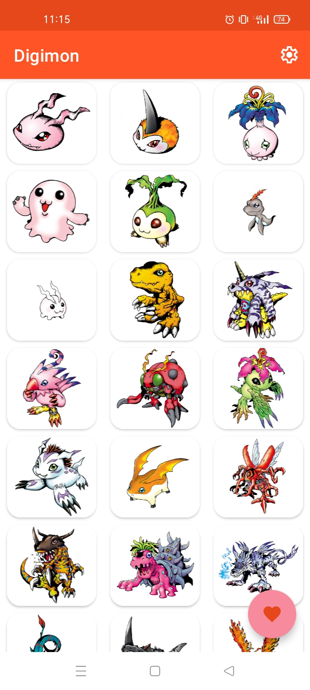
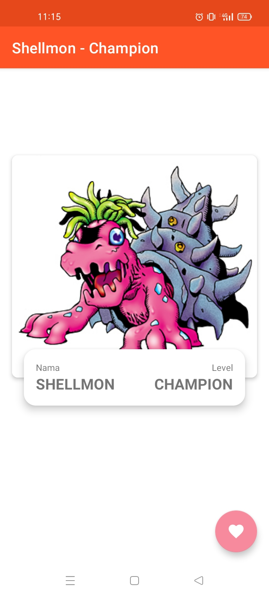
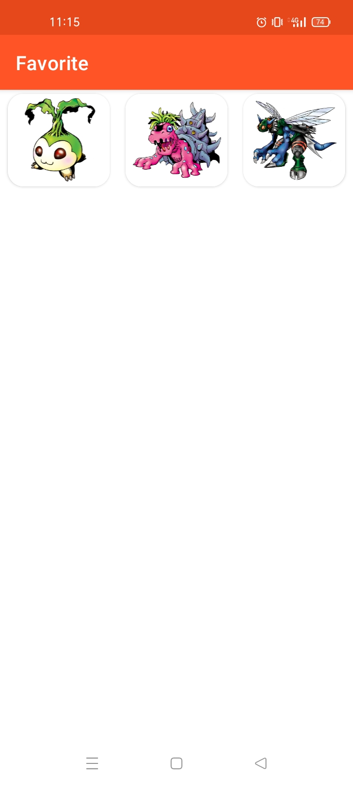
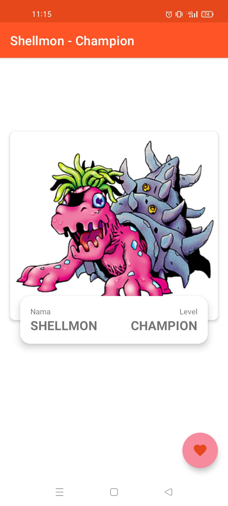
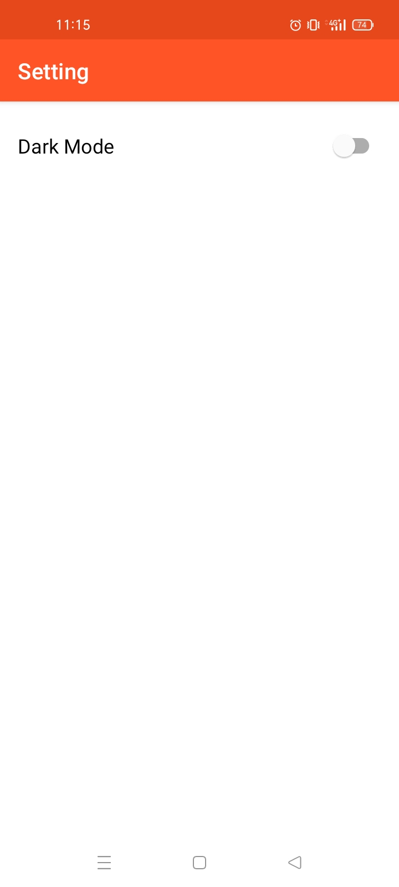
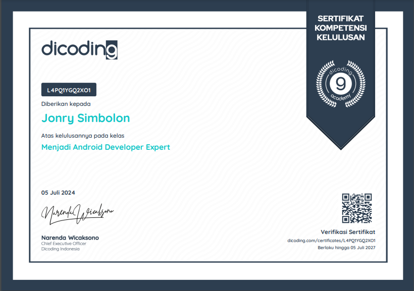
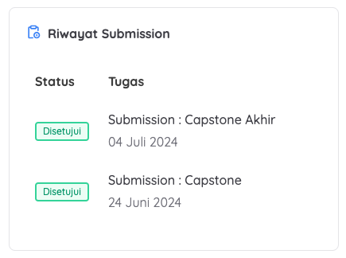
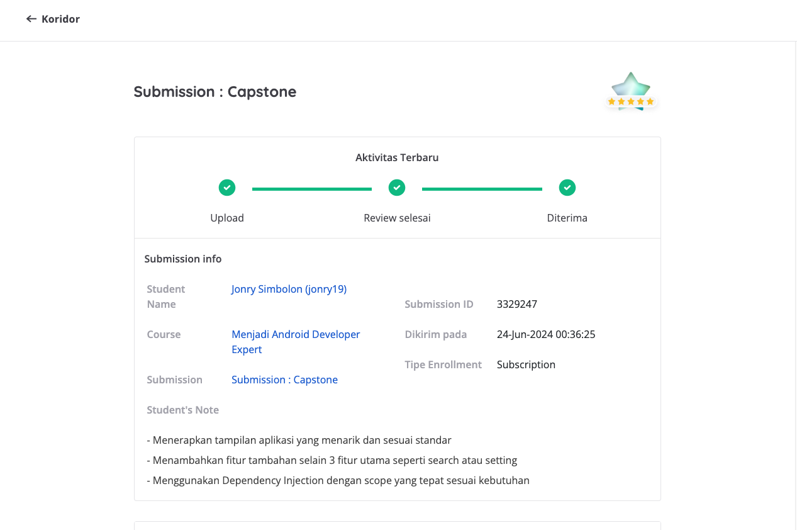
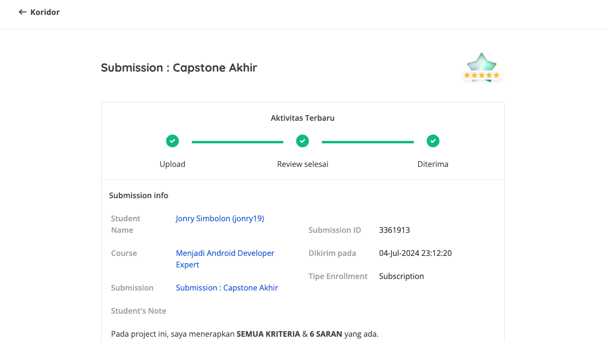
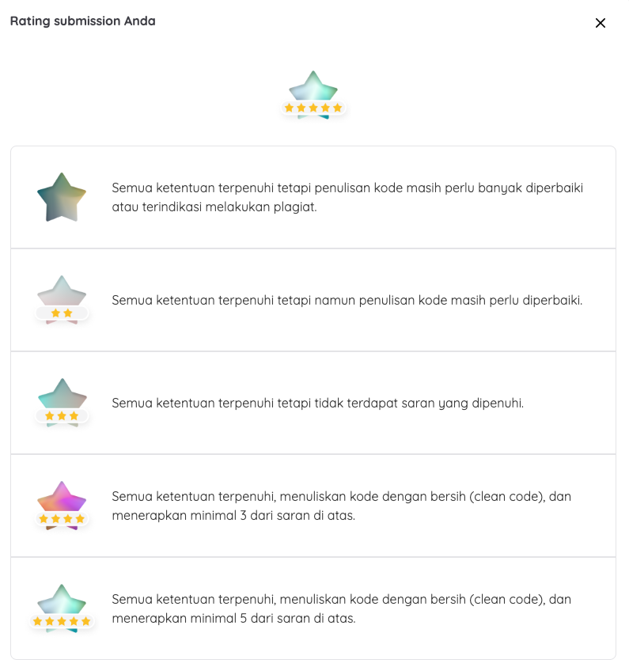

# Game Capstone 1 android expert

- [API Digimon](https://digimon-api.vercel.app/)
- [Koin as DI](https://github.com/InsertKoinIO/koin)
- [Flow from coroutine](https://developer.android.com/kotlin/flow)
- [Clean Architecture](https://developer.android.com/topic/architecture)
- [Modularization](https://developer.android.com/topic/modularization)

# Screenshot

|       |
  |----------------------------------------------------------------------------------------------------------------------------------------------------------------------------------------------------------------------------------------------------------------------------------------------------------------------------------------------------------|

# 👀️ 🚀️ 🎉️

    

<h3 align="center">Certificate</h3>

    

<h4 align="center">Riwayat</h4>

    

<h4 align="center">Submission 1</h4>

    

<h4 align="center">Submission 2</h4>

    

<h4 align="center">Desc of star</h4>

# Certificate

[Certificate by @dicoding](https://www.dicoding.com/certificates/L4PQ1YGQ2XO1)
